# snakeAi
Reinforcement Learning with the classic snake game

## Preview
<blockquote>
  starting from left, middle, right, 80, 120, 286 number of generations
</blockquote>

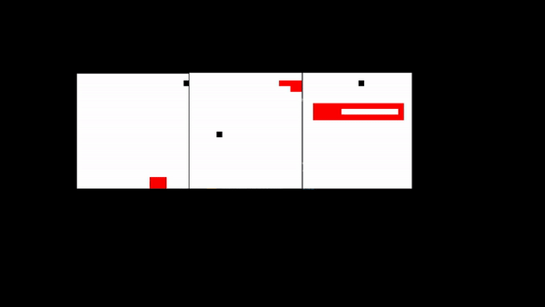

<object data="Final Project Report.pdf" type="application/pdf" width="700px" height="700px">
    <embed src="http://yoursite.com/the.pdf">
        <p>Final Report: <a href="Final Project Report.pdf">Download PDF</a>.</p>
    </embed>
</object>

## Installations 
---


install pytorch from here: https://pytorch.org/

```bash
pip install -r requirements.txt
```


## Run The Game
---
```bash
python main.py
```

## Configurations
All static settings are in settings.py
```python
import random

# snake size
SIZE = 20

# ranges for defining close and far
CLOSE_RANGE = (0, 2)
FAR_RANGE = (CLOSE_RANGE[1], 9)

set_size  = lambda x: SIZE * x

DEFAULT_WINDOW_SIZES = (32, 24)

# set to None to change to Default
WINDOW_N_X = 12
WINDOW_N_Y = 12


SCREEN_WIDTH = set_size(WINDOW_N_X) or set_size(DEFAULT_WINDOW_SIZES[0])
SCREEN_HEIGHT = set_size(WINDOW_N_Y) or set_size(DEFAULT_WINDOW_SIZES[1])

DEFAULT_KILL_FRAME = 100
DEFAULT_SPEED = 50 # change the speed of the game
DEFAULT_N_FOOD = 1
DECREASE_FOOD_CHANCE = 0.8

# Neural Networks Configuration
HIDDEN_SIZE = 256
OUTPUT_SIZE = 3

MAX_MEMORY = 100_000
BATCH_SIZE = 1000
LR = 0.001

GAMMA = 0.9

EPSILON = 80

EPS_RANGE = (0, 200)
is_random_move = lambda eps, eps_range: random.randint(eps_range[0], eps_range[1]) < eps


DEFAULT_END_GAME_POINT = 300
```

## Adding New Windows

Go to main.py and add more windows and processors
```python

class Windows(Enum):
    """
    Windows enums
    W_i = (m, n, s, k)
    where m is number of row tiles
          n is number of column tiles
          s is number of row processors
          k is number of column processors
    """
    #W1 = (20, 20, 1, 3)
    # W2 = (20, 20, 3, 1)
    # W5 = (20, 20, 3, 1)
    #W4 = (20, 20, 1, 1)
    # W6 = (20, 20, 3, 1)
    # W7 = (20, 20, 3, 1)
    # W8 = (20, 20, 3, 1)
    # W9 = (20, 20, 3, 1)
    # W10 = (20, 20, 3, 1)
    # W11 = (20, 20, 3, 1)
    # W12 = (20, 20, 3, 1)
    # W13 = (20, 20, 3, 1)
    W14 = (20, 20, 1, 1)
```

### Run The Window

The following will run window 14
```python

if __name__ == "__main__":
    Game(14)
```

## Adding Parameters To Processors
---
In par_lev.json:
Add parameters for instance "world 1" where world is (20, 20, 1, 3) the following: 
first processor will have all these parameters, second the epsilon changes to 80 and graph name different and third parameters will use the 
default, look at the report for more info on default values and settings.py.
```json
{
"W1":[
    {
      "empty_cell":0,
      "very_far_range":0,
      "close_range":0,
      "far_range":0,
      "col_wall":-10,
      "loop":-10,
      "scored":10,
      "gamma":0.5,
      "eps":200,
      "eps_range":[0, 200],
      "hidden_size":256,
      "n_food":1,
      "decrease_food_chance":-1,
      "kill_frame":100,
      "num_games":-1,
      "is_dir":true,
      "moving_closer":10,
      "moving_away":-10,
      "lr":0.0005,
      "graph":"epsilon__200__0"
    },
    {
      "eps":80,
      "graph":"epsilon__200__1"
    },
    {
    }    
  ]
 }
```

# Reinforment Learning Using Snake Game
---

  | Main Contributors  | Emails |
  |---| --- |
  | Ronak Ghatalia  |    ronak.ghatalia@ryerson.ca |
  | Sourena Khanzadeh  | sourena.khanzadeh@ryerson.ca |
  |  Fahad Jamil  |   f1jamil@ryerson.ca | 
  |  Anthony Greco  | anthony1.greco@ryerson.ca |


# Introduction
---

Reinforcement learning (RL) is an area of machine learning where an agent aims to make the optimal decision in an uncertain environment in order to get the maximum cumulative reward. Since RL requires an agent to operate and learn in its environment, it's often easier to implement agents inside  simulations on computers than in real world situations. 

A common technique to test various RL algorithms is to use an existing video game where the agent learns from its interactions with the game. Video games are an ideal environment to test RL algorithms because (1) they provide complex problems for the agent to solve, (2) they provide safe, controllable environments for the agent to act in, and (3) they provide instantaneous feedback which makes training agents much faster.

For the reasons listed above, we have chosen to implement an RL agent on the classic game Snake. Snake is an arcade game originally released in 1976 where the player maneuvers a snake-like line to eat food that both increases their score and the size of the snake. The game ends when the snake collides with a wall or with itself. The score of the game is simply the number of food the player's collected. Since each food collected increases the size of the snake, the game gets increasingly difficult as time goes on. 

We chose to use Deep Q-Learning as our algorithm to allow our agent to make optimal decisions solely from raw input data. No rules about the Snake game are given to the agent. This approach consists of solely giving the agent information about the state of the game and providing either positive or negative feedback based on the actions it takes. Our agent was more performant than we expected, showing strategy and rapid improvement after only 200 games. We will go into more detail of our results later in the paper.

# Related Research
---

A paper was published that used a learned policy gradient that is used to update the value function and learn from it with bootstrapping. It found that this "generalizes effectively to complex Atari games" It includes what to predict (value function) and how to learn from it (bootstrapping) [2].

Research has expanded from simple games to more complex strategy games. Amato and Shani conducted research on using reinforcement learning to strategy games. They found that it was helpful to use different policies depending on different contexts [3]. 

Deep learning is also being used in reinforcement learning. A paper was published that used a convolutional neural network with Q learning to play Atari games [4]. The paper found that its agents did better than previous reinforcement learning approaches. 

There have been several attempts to use bandits in video games. A paper was published that used semi-bandit and bandit and both cases were found to converge to a Nash equilibrium [5]. This is done by ensuring the exploration factor ε never falls below 0.

# Problem Statement and Environment
---

## Obstacles
---

RL agents face two challenging obstacles in learning the optimal actions in its environment: (1) the environment has incomplete information and/or (2) the state spaces of the agent are extremely large. Luckily in the game Snake we only have to deal with the latter.

## Environment and State Space
---

The environment of the Snake game can be represented as a n x n matrix of cells. Each cell has a width and height of l pixels. A naive approach to building the state would be to simply feed the pixel image of the game to the agent. From the dimensions mentioned above, the state space would be of size |S| ∈ (n x n x l x l). While this method may work for smaller image sizes, training quickly becomes infeasible as the size of the image grows. The simplest way to reduce state size would be to ignore pixels altogether and only feed the agent information about the game cells. The size of the state space would reduce to |S| ∈ (n x n). This way of representing state is still not ideal as the state size increases exponentially as n grows. We will explore state reduction techniques in the next section.

## Action Space
---

Due to the simplistic nature of Snake there are only four possible actions that can be taken: up, down, left, and right. To speed up training and reduce backwards collisions, we simplified the actions down to three: straight, clockwise turn, and counter-clockwise turn. Representing the actions in this way is beneficial because when the agent 'explores' and randomly picks an action, it will not turn 180 degrees into itself. 

## Positive/Negative Rewards
---

The main reward of the game is when the snake eats food and increases its score. Therefore the reward is directly linked to the final score of the game, similar to how a human would judge its reward. As we will discuss later, we experimented with other positive rewards but ran into a lot of unexpected behaviour. With other positive rewards, the agent may loop infinitely or learn to avoid food altogether to minimize its length. We included additional negative rewards to give the snake more information about its state: collision detection (with itself or wall), looping (discourages infinite loops), empty cell, and close/mid/far/very_far from food (encourages pathing towards food).


# Methods and Models
---

A common RL algorithm that is used is Q-Learning which has been expanded to include neural networks with Deep Q-Learning methods. We decided that we could experiment with this new method that is gaining popularity and is used in previous research done with Atari games [4].

To begin our tests we first used PyGame to create our own Snake game with the basic rules of movement. The snake's actions  are simply to move forward, left, or right based on the direction its facing. The game ends if the snake hits itself or the wall. As it consumes food it grows larger. The goal is to get the snake to eat as much food as possible without ending the game.

After the game was created we created a Deep Q-Learning network using PyTorch. We created a network with an input layer of size 11 which defines the current state of the snake, one hidden layer of 256 nodes, and an output layer of size 3 to determine which action to take. Pictured below is a visual representation of our network.

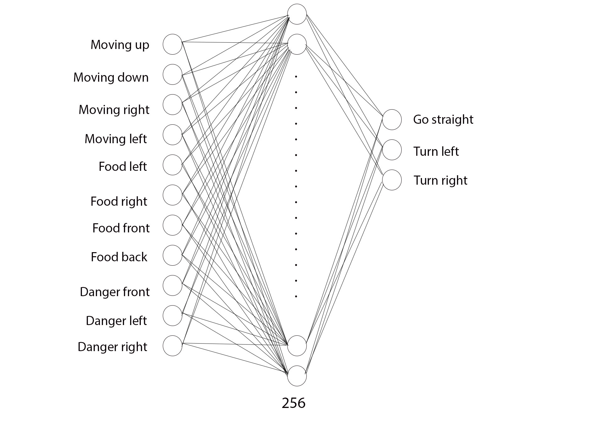

Due to the discrete time steps (frames) of the game, we are able to calculate a new state for every new frame of the game. We defined our state parameters to be 11 boolean values based on the direction the snakes moving, the location of danger which we define as a collision that would occur with an action in the next frame, and the location of food relative to the snake. Our 3 actions (the output layer) are the directions of movement for the snake to move relative to the direction it's facing: forward, left, or right. 

The state at every time step is passed to the Q-Learning network and the network makes a prediction on what it thinks is the best action. This information is then saved in both short term and long term memory. All the information learned from the previous states can be taken from memory and passed to the network to continue the training process. 


# Experiments
---

We wanted to test how well the Deep Q-Learning network learns the Snake environment and the best way to optimize the performance of the agent. We included a base case where the agent follows a random, untrained policy to see how that agent compares to a trained agent. We then tested many different parameters while keeping the others constant to see how the impacts different values have on the overall performance.
Below is the performance of a random agent.

To reduce randomness in our data we ran every experiment with three separate agents and took the mean average of all of them. Due to limitations in both processing and time we constrained our experiments to a maximum of 300 games to ensure we could effectively test and compare every parameter.

We will be presenting our results with a double plot. The top plot will be the 5 game moving average of the score and the bottom plot will be the highest score the agent achieved.

## No Training (Base Case)
---

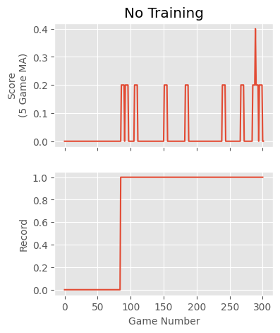

The untrained agent moved around sporadically and without purpose. The highest score it achieved was only one food. As expected, there was no improvement in performance.

## Default Parameters
---

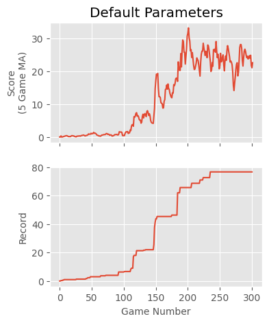

We decided to set our default parameters as the following, and made changes to individual parameters to see how they would change the performance: 

```python
  Gamma = 0.9
  Epsilon = 0.4
  Food_amount = 1
  Learning_Rate = 0.001
  Reward_for_food (score) = 10
  Collision_to_wall = -10
  Collision_to_self = -10
  Snake_going_in_a_loop = -10
```
 
## Gamma
---

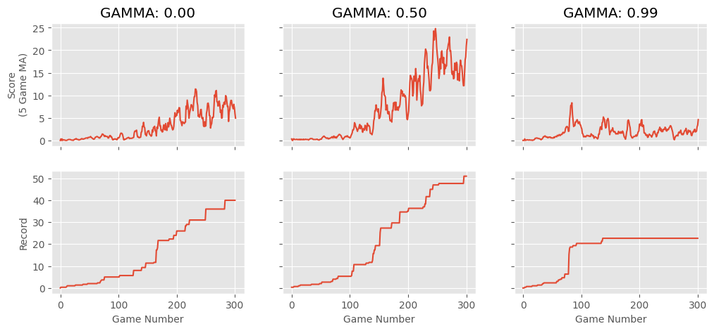

We decided to test gamma values of 0.00, 0.50, and 0.99. A gamma of 0.00 means that the agent is only focused on maximizing immediate rewards. We assumed a gamma of 0 would be ideal because the game of Snake is not a game where you have to think very far in the future. The results show that the best performance was with a gamma of 0.50 which showed much better performance than the other two. We are unsure why a gamma of 0.99 performed so badly. Our default value of gamma=0.90 performed the best. This demonstrates that it is necessary to fine tune gamma to balance the priority of short term reward vs long term.

## Epsilon
---

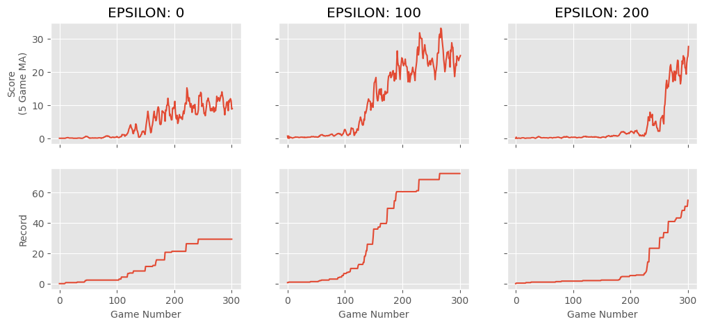

Our epsilon decays by 0.005 every game until it reaches 0. This allows our agent to benefit from exploratory learning for a sufficient amount of time before switching to exploitation.
 
We wanted to test how changing the balance between exploration and exploitation impacts the performance. We decided to try no exploration (epsilon = 0), a balance of both (epsilon = 0.5), and the largest amount of exploration at the beginning (epsilon = 1).

As seen by the graph above, an epsilon of 0 performs poorly because without exploration the agent cannot learn the environment well enough to find the optimal policy. An epsilon of 0.5 provides an even balance of exploring and exploitation which greatly improves the learning of the agent. An epsilon of 1 maximizes the amount of time the agent explores in the beginning. This results in a slow rate of learning at the beginning but a large increase of score once the period of exploitation begins. This behaviour proves that high epsilon values are needed to get a higher score. To conclude, epsilon values of 0.5 and 1 both seem to be more performant than the default of 0.4.

## Rewards
---

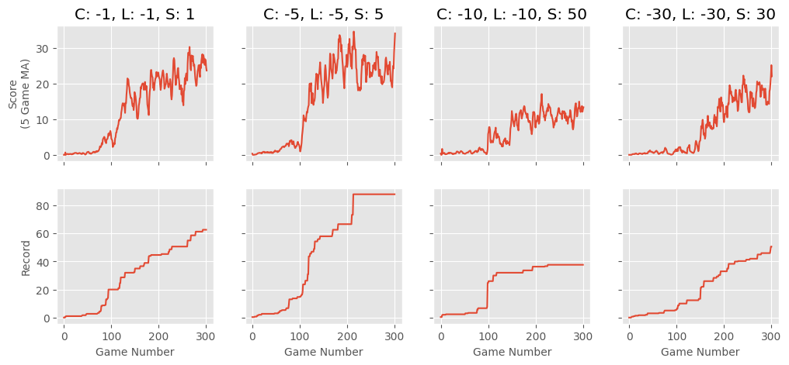

In this experiment we decided to change the immediate rewards. Our immediate rewards were (S) score for eating food, (C) collision with the wall or itself, and (L) moving in a loop. An interesting result we came across is that having a large difference between positive and negative rewards negatively affects the performance of the agent. This may be because the agent will learn to focus on the larger of the negative or positive rewards therefore making rewards of equal magnitude be more performant. We also found that having rewards that are small in scale do better than rewards that are large in scale. The best performance we found was with rewards of C=-5, L=-5, and S=5. Rewards of C=-1, L=-1, and S=1 performed very similarly to the previous agent. Larger rewards of 30 and -30 performed much worse. The performance of rewards C=-5, L=-5, and S=5 did slightly better than default.
 
## Learning rate
---

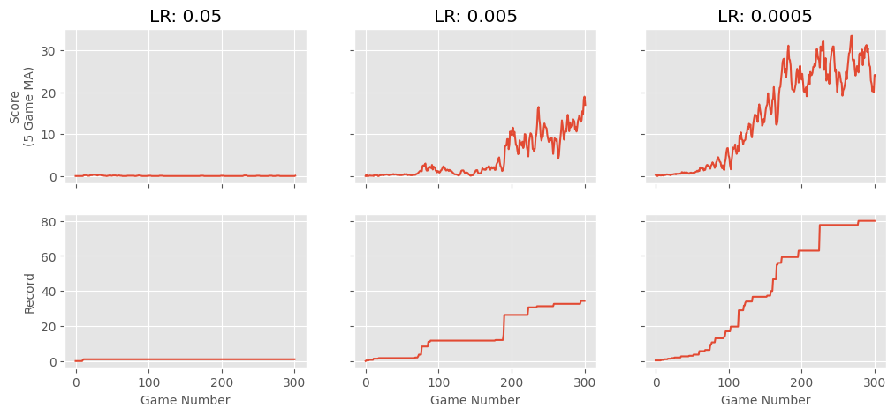

Changing the learning rate impacts the way our agent finds an optimal policy and how fast it learns. We found that a learning rate of 0.05 was too high since it performed similar to our untrained agent. This poor performance is likely because the agent was skipping over the optimal by taking too large a step size. This means that the agent moves too quickly from one suboptimal solution to another and fails to learn. We noticed a strong correlation between lower learning rates and higher scores. Our best performing agents had the lowest learning rates with lr = 0.0005 performing better than our default of lr = 0.001.

## Facing/Not Facing Food
---

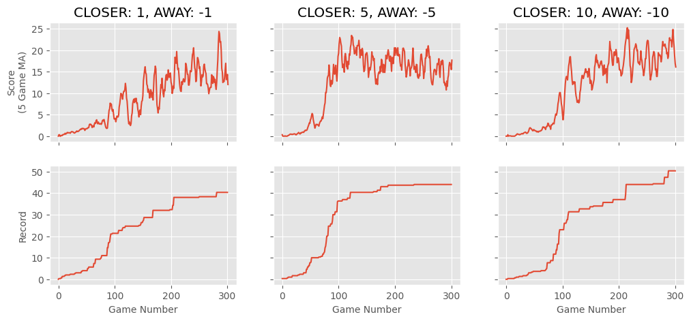

We attempted to use a reward for facing the food to encourage pathing towards it. We gave the snake a positive reward for moving towards the food and a negative reward for moving away from the food. The rewards of 10 and -10 seemed to perform the best with the agent achieving the highest score. While the results were interesting, every agent performed worse compared to the default with this new information.

 
## Distance To Food
---

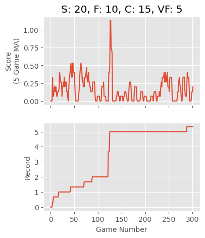

We added several rewards depending on the distance from the snake to the food. Our rewards were (S) score for eating food, (C) close reward for being 1-2 tiles away, (F) far reward for being 2-9 tiles away, and (VF) very far reward for being anything further. This experiment showed terrible performance and was only slightly better than the untrained agent. We think the positive rewards negatively affected the agent by training it to avoid food and instead continuously collect the positive distance rewards. We did not continue to experiment with these rewards because of poor performance.

## Multiple Food and Food Decay
---

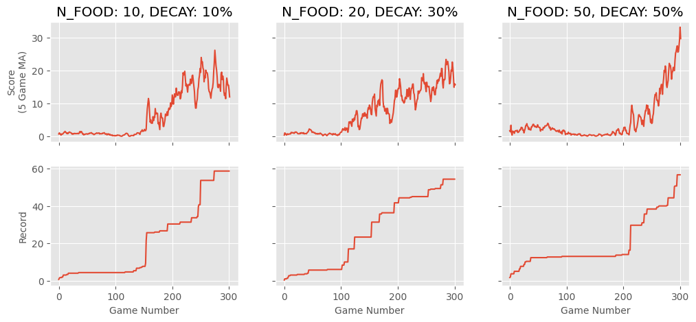

The normal Snake game is played with only a single food on screen at a time. We tested to see if using multiple food at the start and then slowly taking food away would increase the rate at which the agent learned. Unfortunately, the agent did not seem to not learn until the food decayed to 1 in all tests. We believe this is due to a bug in our implementation. Due to the massive amount of food on screen, the agent gets signals that there is food above, below, to the left, and to the right of it. Therefore the snake is essentially "blinded" by food signals and has no better choice other than to take a random action. This behaviour stops when the number of food decays back to 1.


# Implementation and Code
---

We started out by making the snake arcade game using PyGame and numpy packages (Appendix A). The game is created inside game.py, the snake is represented as a class and is responsible for snake movement and eating/collision functionalities. The window is n x m pixels where n x m is the number of tiles of size S2 where S is the length of the snake. All static configuration is in settings.py which includes a mix of constants and few lambda functions. 

The snake moves by tiles of size S2 which are appended to the head of the snake and the rest of the body is popped until the current size of the snake is satisfied in the direction of the movement. There are 4 directions: “left”, “right”, “up”, “down”. For simplicity the snake can only turn left, right, or keep moving straight as an action. Food generation is also implemented inside of the snake, where it will generate food randomly inside of the environment and will regenerate if it is inside of the body of the snake. The game class creates an array size of (11, 1) bits that is stored as the state. The state includes: danger in right turn, danger in straight, danger in straight, currently moving, left, currently moving right, currently moving up, currently moving down, food on left side of snake, food on right side of snake, food above snake, and food below the snake. 

Agent.py is responsible for short term memory, long term memory, getting a random action, or getting a predicted action from the model. Model.py is responsible for training the model and using PyTorch and numpy packages to implement Deep Q-Learning. Main.py is responsible for putting everything together and running the actual game. We implemented a multiprocessing multilevel script which reads the parameters of every processor and runs them on separate windows [6][7][8][9][10][11][12].

# Conclusion
---
Based on our experiments we decided to take the optimal values we found to see how the agent would perform over a 1000 games compared to the default. The optimal parameters we used were:
* Gamma = 0.9
* Epsilon = 1
* Food amount = 1
* Learning Rate = 0.0005
* Reward for food (score) = 5
* Collision to wall = -5
* Collision to self = -5
* Snake going in a loop = -5

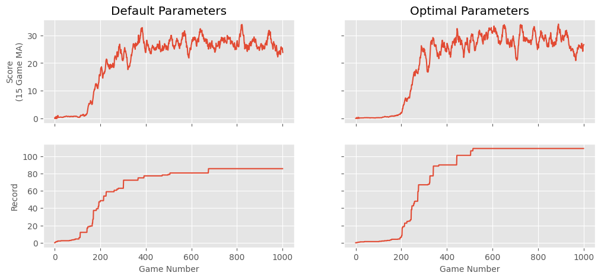

The performance of our optimal agent is slightly better than the default. This is because our default parameters were similar to the optimal parameters from our experiments. Further experimentation would allow for more finetuning of parameters to increase performance.
	From our experiments we found that the learning rate, epsilon, gamma, and immediate rewards were the parameters that had the biggest impact on performance. The experiments with direction, distance, and food generation were detrimental to performance and are not parameters that would help with the optimal performance.


Based on our experiments we decided to take the optimal values we found to see how the agent would perform over a 1000 games compared to the default. The optimal parameters we used were:
```python
Gamma = 0.9
Epsilon = 1
Food amount = 1
Learning Rate = 0.0005
Reward for food (score) = 5
Collision to wall = -5
Collision to self = -5
Snake going in a loop = -5
```

The performance of our optimal agent is slightly better than the default. This is because our default parameters were similar to the optimal parameters from our experiments. Further experimentation would allow for more finetuning of parameters to increase performance.

From our experiments we found that the learning rate, epsilon, gamma, and immediate rewards were the parameters that had the biggest impact on performance. The experiments with direction, distance, and food generation were detrimental to performance and are not parameters that would help with the optimal performance.

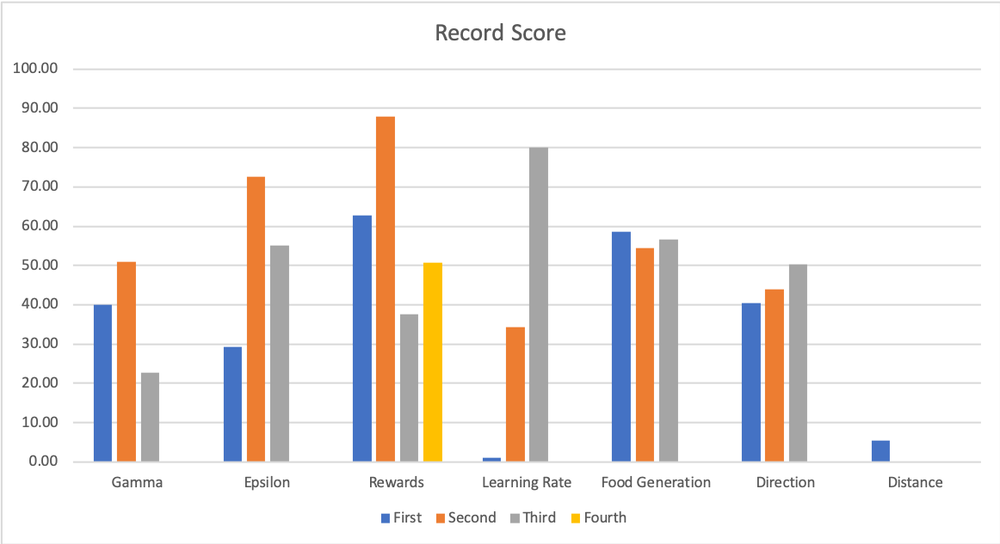

Above is a graph showing the high scores for each experiment for each parameter.
	
We combined the parameters that had the best impact on performance and used them as part of our optimal parameters. We found that small changes in the learning rate had the largest difference in performance. From the lowest to its highest result, the difference was a record of 79. The rewards had the second largest range, then epsilon, and then gamma. 

Our experiments were a starting point of looking at parameters that would impact Deep Q-Learning. Further research could be done to tune the main parameters to optimize the model further. 

## UML
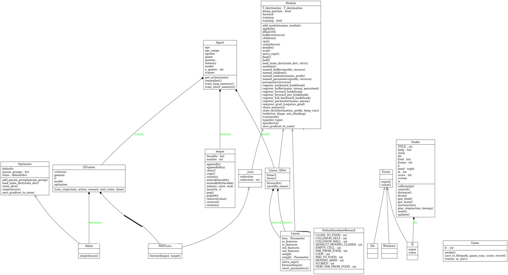
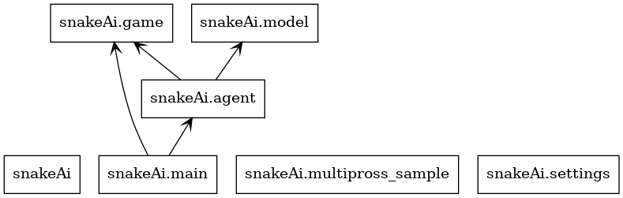

##### References

1. https://github.com/sourenaKhanzadeh/snakeAi
2. https://arxiv.org/pdf/2007.08794.pdf 
3. https://www.researchgate.net/publication/221455879_High-level_reinforcement_learning_in_strategy_games
4. https://arxiv.org/abs/1312.5602 
5. https://papers.nips.cc/paper/2017/file/39ae2ed11b14a4ccb41d35e9d1ba5 d11-Paper.pdf
6. https://medium.com/@hugo.sjoberg88/using-reinforcement-learning-and-q-learning-to-play-snake-28423dd49e9b
7. https://towardsdatascience.com/learning-to-play-snake-at-1-million-fps-4aae8d36d2f1
8. http://cs229.stanford.edu/proj2016spr/report/060.pdf
9. https://mkhoshpa.github.io/RLSnake/
10. https://docs.python.org/3/library/multiprocessing.html
11. https://github.com/eidenyoshida/Snake-Reinforcement-Learning
12. https://github.com/python-engineer/snake-ai-pytorch/blob/main/model.py


